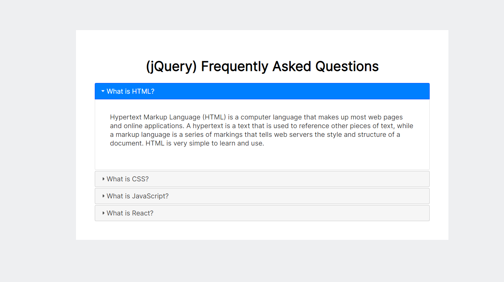
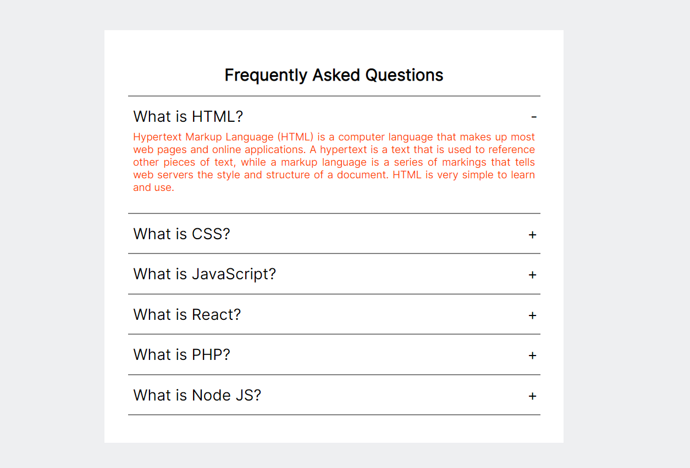

# Accordions
This project will contain multiple methods of creating Nice Accordions (Collapsible content) using HTML, CSS & Javascript

## [Using Bootstrap](bootstrap_accordion.html)
Bootstrap is a free and open-source web development framework. It’s designed to ease the web development process of responsive, mobile-first websites by providing a collection of syntax for template designs.
One can build vertically collapsing accordions in combination using the Collapse JavaScript plugin which is integrated within Bootstrap.
One needs to simply add “accordion” to the class attribute of a div and define the accordion-items within that div.
 
 

## [Using JQuery](jquery_accordion.html)
The purpose of jQuery is to make it much easier to use JavaScript on your website.
We can accomplish creating our accordions using the pre-defined accordion method within the Jquery library.
 
 

## [Plain HTML,CSS, JS](html_accordion.html)
You can use HTML, CSS and JavaScript to create a stylish and dynamic accordion menu.
 
 

